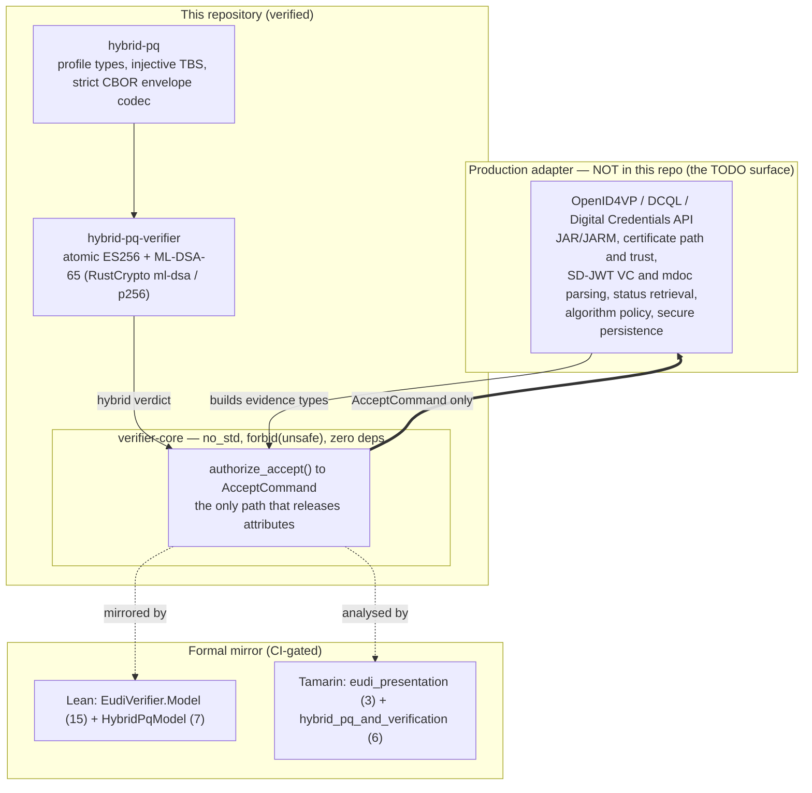
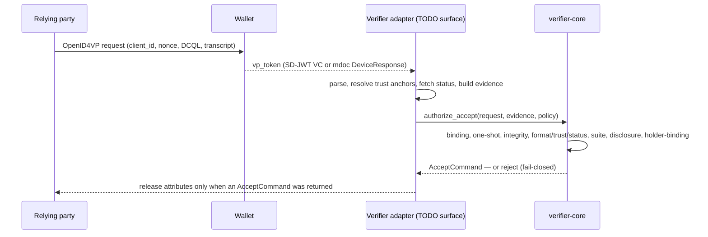
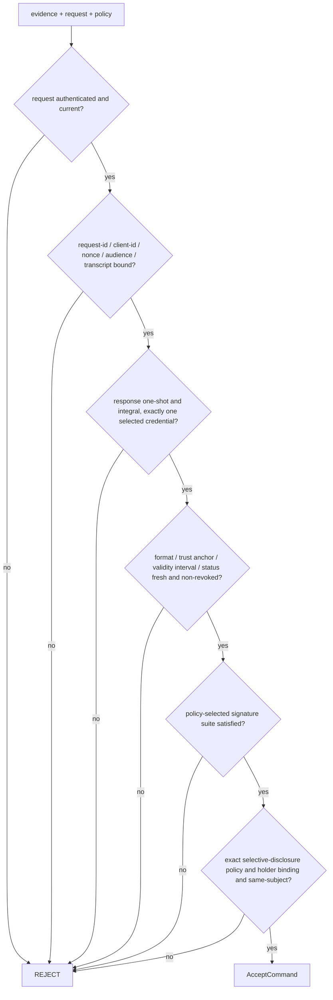
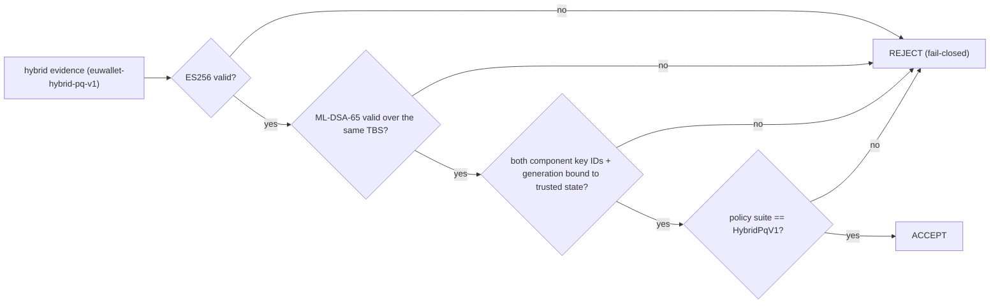

# EUDI Formal Credential Verifier — `VCVerifier`

[](.github/workflows/verify.yml)
[](#license)
[](rust/rust-toolchain.toml)
[](rust/verifier-core/src/lib.rs)
[](rust/verifier-core)

A minimal-dependency, formally-analysed Rust **relying-party verification kernel** for the EU Digital
Identity (EUDI) Wallet ecosystem. It follows the assurance architecture of
[`../VCIssuer`](https://github.com/advatar/VCIssuer): normative traceability, a pure safe-Rust decision
boundary, Lean semantic proofs, Tamarin protocol analysis, and explicit adapter contracts.

> **Scope, up front.** This is a **verified verifier _kernel_, not a deployable OpenID4VP endpoint and
> not a certification claim.** `standards.lock.toml` deliberately keeps `production_ready = false`. The
> network/parsing/trust plumbing lives in a production adapter you must still build (see
> [Assurance boundary](#assurance-boundary)).

---

## What it checks

The kernel accepts **structured evidence** for both SD-JWT VC and mdoc and decides acceptance over:

- authenticated and current presentation requests;
- request ID, client ID, nonce, audience, and session-transcript binding;
- one-shot response use (no replay);
- response integrity and **exactly one** policy-selected credential;
- credential format/type, trust anchor, signature validity interval, fresh status, and non-revocation;
- the policy-selected signature suite, including the isolated hybrid post-quantum suite;
- exact selective-disclosure policy;
- cryptographic holder binding and same-subject policy.

Only [`authorize_accept`](rust/verifier-core/src/lib.rs) can produce an `AcceptCommand`, and **only that
command may release attributes to an application**. The decision kernel is `no_std`, forbids unsafe code,
and has no dependencies.

## Highlights

- **One release capability.** `authorize_accept → AcceptCommand` is the sole path that releases
  attributes; every check is fail-closed.
- **Zero-dependency `no_std` kernel** with `#![forbid(unsafe_code)]` — a small, auditable trusted core.
- **Formally mirrored**: 22 Lean theorems (0 `sorry`/`axiom`) + 9 Tamarin lemmas, CI-gated.
- **Isolated hybrid post-quantum suite** (`euwallet-hybrid-pq-v1`): atomic ES256 + ML-DSA-65,
  **AND-only / downgrade-closed**, pinned to shared VCIssuer/EUWallet test vectors.
- **Honest boundary**: the production adapter surface (OpenID4VP/DCQL, trust, parsing, status, …) is
  enumerated as TODO, not implied to exist.

---

## Architecture



The adapter turns wire artifacts into the kernel's evidence types and consumes an `AcceptCommand` — it
must never bypass that command to release attributes.

## How it's built (design decisions)

- **Kernel/adapter split**, mirroring VCIssuer. All I/O, parsing, trust resolution, and status fetching
  are adapter responsibilities; the kernel is a pure function over structured evidence. This keeps the
  trusted computing base tiny and lets the same decision be proved in Lean and analysed in Tamarin.
- **`AcceptCommand` as an unforgeable capability.** Attributes are released *only* by presenting the
  command that `authorize_accept` alone constructs — there is no "accept" side-channel.
- **`no_std` + zero-dependency core.** `verifier-core` compiles without `std` and pulls in no crates, so
  the audit surface is the kernel source itself.
- **Formal mirroring, not aspiration.** `authorize_accept` is mirrored by `EudiVerifier.Model`
  (Lean) and the presentation protocol by Tamarin; both are gated in CI (`lake build`, `--prove`).
- **Hybrid-PQ is additive and policy-selected.** Classical SD-JWT VC and mdoc credentials verify through
  the classical suite; a credential only needs a PQ component when the relying-party policy selects
  `HybridPqV1`. Acceptance is **AND-only** — no classical-only or PQ-only success state.

## Key flows

### Presentation verification



### `authorize_accept` decision gates (every gate fail-closed)



### Hybrid post-quantum acceptance (downgrade-closed)



`required_signature_suite_is_enforced` (Lean) proves a hybrid-required policy can never be satisfied by
classical-only evidence.

## Hybrid post-quantum support

The workspace verifies the isolated `euwallet-hybrid-pq-v1` profile ported from
[`../EUWallet`](https://github.com/advatar/EUWallet): atomic ES256 + ML-DSA-65 (FIPS 204) signatures over
one domain-separated byte string, carried in strict magic-prefixed deterministic-CBOR envelopes.

- [`rust/hybrid-pq`](rust/hybrid-pq) — dependency-free profile types, the injective TBS construction, and
  the strict envelope codec, pinned against the wallet repository's published vectors in
  [`docs/test-vectors`](docs/test-vectors).
- [`rust/hybrid-pq-verifier`](rust/hybrid-pq-verifier) — the atomic verification adapter
  (`verify_hybrid_signature_atomic`, `verify_hybrid_credential_wrapper_atomic`) backed by RustCrypto
  `ml-dsa` and `p256`. Acceptance is AND-only; downgrade attempts fail closed.
- The frozen test credential wrapper commits its payload and ordered disclosures into the common TBS and
  binds both component key IDs plus their generation to trusted verifier state. Shared VCIssuer/EUWallet
  vectors cover real signatures and 33 fail-closed mutations.

See [`docs/experimental-hybrid-pq-verification.md`](docs/experimental-hybrid-pq-verification.md). The
profile is **experimental, default-off, non-EUDI, and not a conformity claim**.

## Build & run

Toolchain is pinned by [`rust/rust-toolchain.toml`](rust/rust-toolchain.toml) (Rust **1.88.0**); Lean by
`formal/lean/lean-toolchain`; Tamarin must be on `PATH`.

```sh
# Rust kernel + adapters — 47 tests, clippy pedantic as errors
cd rust
cargo test --workspace
cargo clippy --workspace --all-targets -- -D warnings

# Lean semantic proofs — 22 theorems, 0 sorry / 0 axiom
cd ../formal/lean
lake build

# Tamarin protocol analysis — 9 lemmas across both theories
cd ../tamarin
tamarin-prover eudi_presentation.spthy --prove              # 3 lemmas
tamarin-prover hybrid_pq_and_verification.spthy --prove     # 6 lemmas
```

CI ([`.github/workflows/verify.yml`](.github/workflows/verify.yml)) runs the same gates.

## Repository layout

| Path | Purpose |
|---|---|
| `rust/verifier-core/` | the pure decision kernel — `authorize_accept` / `AcceptCommand`. `no_std`, `forbid(unsafe_code)`, zero deps. |
| `rust/hybrid-pq/` | dependency-free hybrid-PQ profile types, injective TBS, strict CBOR envelope codec. |
| `rust/hybrid-pq-verifier/` | atomic ES256 + ML-DSA-65 verification adapter (RustCrypto). |
| `formal/lean/` | Lean mirror — `EudiVerifier/Model.lean` (15) + `EudiVerifier/HybridPqModel.lean` (7). |
| `formal/tamarin/` | `eudi_presentation.spthy` (3 lemmas) + `hybrid_pq_and_verification.spthy` (6 lemmas). |
| `docs/` | experimental hybrid-PQ notes + shared `test-vectors/`. |
| `requirements/traceability.csv` | normative-requirement → artifact traceability. |
| `standards.lock.toml` | pinned standards + the `production_ready = false` interlock. |
| `FORMAL_SPEC.md`, `ASSURANCE_CASE.md`, `THREAT_MODEL.md` | the assurance narrative. |

## Testing & formal assurance

| Tier | Tooling | Count | Notes |
|---|---|---|---|
| Rust | `cargo test --workspace` | **47** | verifier-core 18; hybrid-pq-verifier 11; hybrid-pq 18 |
| Lean | `lake build` | **22 theorems** | `EudiVerifier.Model` 15 + `HybridPqModel` 7; 0 `sorry`/`axiom` |
| Tamarin | `tamarin-prover --prove` | **9 lemmas** | `eudi_presentation` 3 + `hybrid_pq_and_verification` 6 |

All are CI-gated ([`verify.yml`](.github/workflows/verify.yml)) and cover the model and its stated
assumptions only — not arbitrary adapter code.

## Standards & conformance

Targets the EUDI presentation stack — OpenID4VP / DCQL, SD-JWT VC, ISO/IEC 18013-5 mdoc, and the
`euwallet-hybrid-pq-v1` profile (FIPS 204 ML-DSA-65). Exact pins live in
[`standards.lock.toml`](standards.lock.toml). **No conformity is claimed**; official EUDI conformance
suites are part of the production-adapter work.

## Assurance boundary

This is a verified verifier **kernel**, not a deployable OpenID4VP endpoint and not a certification claim.
A production adapter must still implement and test OpenID4VP/DCQL or the Digital Credentials API, JAR/JARM
where applicable, certificate path and verifier/issuer trust, SD-JWT VC and mdoc parsing and cryptography,
status retrieval, algorithm policy, secure persistence, and official EUDI conformance suites — turning
those checks into the evidence types the kernel consumes, without bypassing `AcceptCommand`.

`standards.lock.toml` deliberately keeps `production_ready = false` until licensed standards, scheme
rulebooks, immutable artifacts, hashes, adapters, and external conformity evidence are complete.

See [`FORMAL_SPEC.md`](FORMAL_SPEC.md), [`ASSURANCE_CASE.md`](ASSURANCE_CASE.md),
[`THREAT_MODEL.md`](THREAT_MODEL.md), and [`requirements/traceability.csv`](requirements/traceability.csv).

## Status & roadmap

- **Implemented + proven:** the `authorize_accept` kernel and its checks; classical SD-JWT VC + mdoc
  evidence verification; the isolated hybrid-PQ suite (AND-only, downgrade-closed); the Lean/Tamarin
  mirror; shared test-vector conformance.
- **Experimental (default-off, non-EUDI):** the `euwallet-hybrid-pq-v1` profile.
- **Not done (production-adapter surface):** OpenID4VP/DCQL + Digital Credentials API wire handling,
  JAR/JARM, real trust-anchor/status infrastructure, secure persistence, and EUDI conformance — tracked
  by `production_ready = false`.

## Contributing

Keep the kernel pure and dependency-free; put I/O, parsing, and trust in adapters. Any change to
`authorize_accept` must keep the Lean model and Tamarin theories in step (both are CI gates), and must
not introduce a path to release attributes other than `AcceptCommand`.

## License

[EUPL-1.2](https://joinup.ec.europa.eu/collection/eupl/eupl-text-eupl-12) (`workspace.package.license` in
[`rust/Cargo.toml`](rust/Cargo.toml)).
